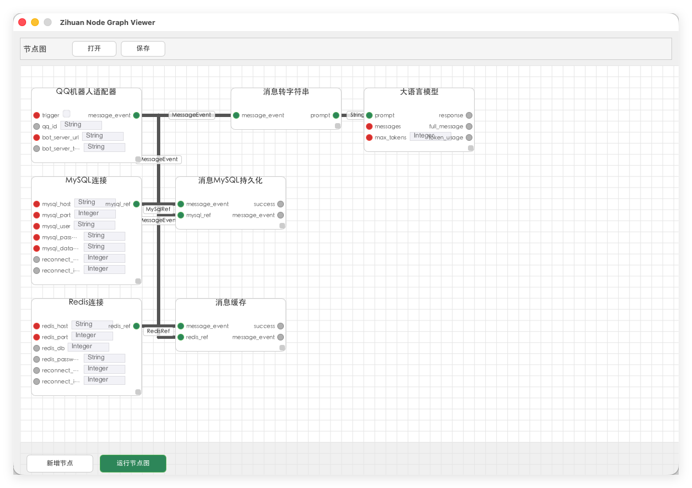

# zihuan-next

**Node-graph-based visual programming system** for building event-driven bot pipelines with composable dataflow components.



## Overview

zihuan-next is a sophisticated automation framework that moves beyond traditional scripting. It uses a **node graph architecture** where everything is a node—from simple data transformations to complex LLM agents.

While currently featuring strong support for QQ bots, it is designed as a **universal workflow engine**. It supports deployment on **Web** and **Edge devices**, allowing complex logic to be executed on non-desktop platforms through simple JSON workflow files.

### Key Capabilities

1.  **Chat Memory**: Maintains conversational context for coherent multi-turn interactions.
2.  **Long Text Collapse**: Intelligently truncates or summarizes lengthy content for readability.
3.  **Hybrid Knowledge Retrieval**: Augments responses using **vector database knowledge graphs** fused with **real-time group chat context**.
4.  **MCP-Inspired Tool Concept**: Implements core Model Context Protocol (MCP) paradigms without server dependency.
5.  **Web-Augmented Dialogue**: Enhances conversations with live web search results.
6.  **Memory-Integrated Training**: Trains models using historical interaction data for contextual awareness.
7.  **Multi-Platform Support**: Extends beyond QQ bots to support Web interfaces and Edge devices, enabling lightweight execution of complex workflows via JSON.
8.  **Rich Content Rendering**: Generates display-ready images from Markdown, code blocks, and LaTeX formulas.

## Architecture

### Core System (`src/node/`)
- **Node Graph Engine**: A DAG (Directed Acyclic Graph) execution engine written in Rust.
- **Port-Based Binding**: Nodes connect via typed Input/Output ports (String, Integer, Json, etc.)—connections are inferred from matching port names.
- **Visual Editor**: built with Slint UI for drag-and-drop workflow creation.

### Integration Components
- **Bot Adapter**: Inbound WebSocket handling from QQ bot servers, converting events into node inputs.
- **LLM Integration**: Special nodes (`LLMNode`, `AgentNode`) that wrap HTTP chat APIs and orchestrate multi-tool reasoning.
- **Message Store**: Three-tier storage architecture (Redis cache → MySQL persistence → In-memory fallback).

## Screenshots


---

## Getting Started

### Prerequisites
- **Rust**: Latest stable toolchain.
- **Python 3.10+**: For database migrations (alembic).
- **Redis**: For caching and message queue.
- **MySQL**: For persistent storage.

### Installation

1.  **Clone the repository**
    ```bash
    git clone https://github.com/FredYakumo/zihuan-next.git
    cd zihuan-next
    ```

2.  **Configuration**
    Copy the example config and edit it with your environment details (Bot Server URL, LLM endpoints, DB credentials).
    ```bash
    cp config.yaml.example config.yaml
    ```

3.  **Start Infrastructure**
    Start Redis using Docker:
    ```bash
    docker compose -f docker/docker-compose.yaml up -d
    ```

4.  **Database Setup**
    Initialize the MySQL schema using Python and Alembic:
    ```bash
    # Install dependencies (recommend using a venv)
    pip install alembic sqlalchemy mysqlclient
    
    # Run migrations
    alembic upgrade head
    ```

### Usage

**Visual Node Editor (GUI Mode)**
Launch the visual editor to design your bot logic.
```bash
cargo run
```

**Headless/Edge Mode**
Run the engine without the GUI (suitable for servers, edge devices, or web backends). You can execute complex workflows by simply loading a JSON file.
```bash
cargo run -- --no-gui
# Or load a specific graph file
cargo run -- --graph-json my_workflow.json --no-gui
```

## Documentation

- **[User Guide](document/user-guide.md)** — Installation, configuration, and running the application
- **[Program Execution Flow](document/program-execute.md)** — Internal execution details for GUI and Headless modes
- **[Node Graph JSON Specification](document/node/node-graph-json.md)** — JSON format for saving and loading node graphs
- **[Node Lifecycle & Execution](document/node/node-lifecycle.md)** — Node execution model, scheduling, and data flow
- **[Node Development Guide](document/node/node-development.md)** — Creating custom nodes and extending the system

## Development

### Creating Custom Nodes
1.  Implement the `Node` trait in a new `.rs` file in `src/node/`.
2.  Define inputs, outputs, and the `execute` logic.
3.  Register the node in `src/node/registry.rs`.

For detailed instructions, see the [Node Development Guide](document/node/node-development.md).

### Project Structure
- `src/node/`: Core graph engine and node definitions.
- `src/bot_adapter/`: QQ Bot WebSocket adapter.
- `src/llm/`: LLM API wrappers and Agent logic.
- `src/ui/`: Slint-based GUI implementation.
- `database/`: Python SQLAlchemy models.
- `migrations/`: Alembic migration scripts.

## License

AGPL-3.0 license // See [LICENSE](LICENSE) file.
