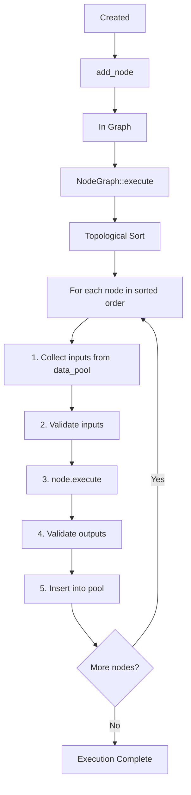
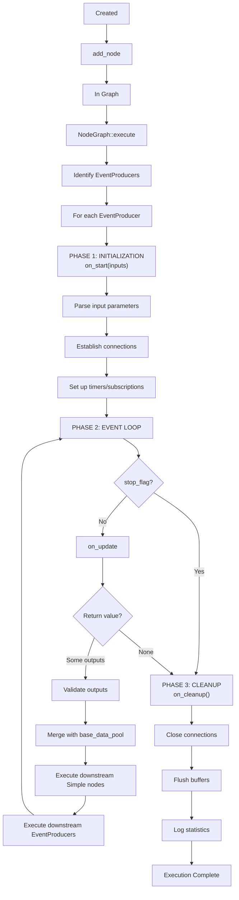
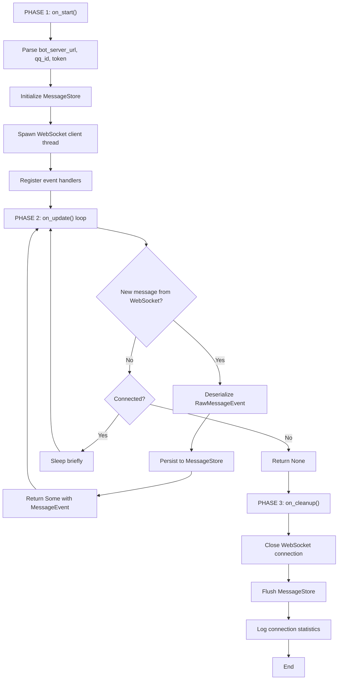
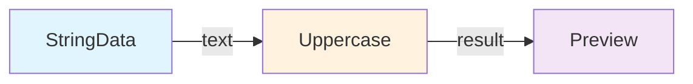
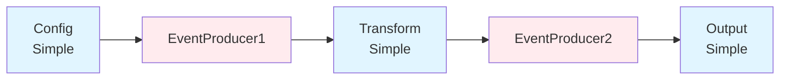
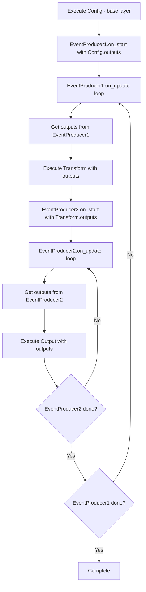

# Node Lifecycle & Execution Flow

> **Target audience:** Developers who need to understand node execution internals, scheduling, and lifecycle management.

This document details the internal execution model of nodes in the zihuan-next system, including lifecycle phases, execution ordering, and concurrency patterns.

---

## Table of Contents

- [Node Execution Models](#node-execution-models)
- [Simple Node Lifecycle](#simple-node-lifecycle)
- [EventProducer Node Lifecycle](#eventproducer-node-lifecycle)
- [Execution Order & Scheduling](#execution-order--scheduling)
- [Data Flow Model](#data-flow-model)
- [Threading & Concurrency](#threading--concurrency)

---

## Node Execution Models

The system supports two fundamentally different execution models:

| Model | When to Use | Key Methods | Stateful? |
|-------|-------------|-------------|-----------|
| **Simple** | Stateless transformations, pure functions | `execute()` | No |
| **EventProducer** | Event sources, timers, streaming data | `on_start()`, `on_update()`, `on_cleanup()` | Yes |

### Simple Nodes

- Execute **once per input set**
- No persistent state between executions
- Examples: String transformations, math operations, conditional logic

### EventProducer Nodes

- Maintain **internal state** across multiple executions
- Run a **lifecycle loop** (start → update loop → cleanup)
- Examples: WebSocket clients, message queues, timers, polling services

---

## Simple Node Lifecycle

Simple nodes follow a straightforward execution path:



### Execution Steps

1. **Input Collection**: Gather values from `data_pool` (outputs of upstream nodes)
2. **Input Validation**: Check that all required ports have values and types match
3. **Execute**: Call the node's `execute()` method with validated inputs
4. **Output Validation**: Verify output types match port declarations
5. **Pool Update**: Insert outputs into `data_pool` for downstream nodes

### Example: UppercaseNode

```rust
impl Node for UppercaseNode {
    fn execute(&mut self, inputs: HashMap<String, DataValue>) 
        -> Result<HashMap<String, DataValue>> {
        // Step 1: Extract input
        let text = inputs.get("text")?.as_string()?;
        
        // Step 2: Transform (stateless)
        let result = text.to_uppercase();
        
        // Step 3: Return output
        Ok(HashMap::from([
            ("result".to_string(), DataValue::String(result))
        ]))
    }
}
```

This node is called exactly once during graph execution.

---

## EventProducer Node Lifecycle

EventProducers have a three-phase lifecycle with an internal event loop:



### Phase 1: Initialization (on_start)

**Purpose:** Set up internal state and establish connections.

**Typical actions:**
- Parse configuration from input ports
- Open network connections (WebSocket, HTTP client)
- Initialize timers or polling threads
- Allocate resources (buffers, caches)

**Example:**
```rust
fn on_start(&mut self, inputs: HashMap<String, DataValue>) -> Result<()> {
    self.url = inputs.get("bot_server_url")?.as_string()?;
    self.ws_client = WebSocketClient::connect(&self.url).await?;
    self.message_store = MessageStore::new(redis_url, mysql_url)?;
    Ok(())
}
```

### Phase 2: Event Loop (on_update)

**Purpose:** Produce events/data on each iteration until exhausted.

**Return values:**
- `Some(outputs)` — New data available, continue loop
- `None` — No more events, exit loop

**Typical actions:**
- Check for new messages/events
- Poll external services
- Generate timer ticks
- Return data via output ports

**Example:**
```rust
fn on_update(&mut self) -> Result<Option<HashMap<String, DataValue>>> {
    // Check for new WebSocket message
    if let Some(msg) = self.ws_client.try_recv()? {
        let event = deserialize_message(msg)?;
        self.message_store.save(&event)?;
        
        return Ok(Some(HashMap::from([
            ("message_event".to_string(), DataValue::MessageEvent(event))
        ])));
    }
    
    // No new data, keep looping
    std::thread::sleep(Duration::from_millis(100));
    Ok(Some(HashMap::new()))  // Return empty to continue
}
```

**Loop termination:**
```rust
// Signal completion by returning None
if self.ws_client.is_closed() {
    return Ok(None);  // Triggers cleanup phase
}
```

### Phase 3: Cleanup (on_cleanup)

**Purpose:** Release resources and perform final actions.

**Typical actions:**
- Close network connections
- Flush buffers to disk/database
- Log statistics
- Free allocated memory

**Example:**
```rust
fn on_cleanup(&mut self) -> Result<()> {
    self.ws_client.close()?;
    self.message_store.flush()?;
    info!("BotAdapter processed {} messages", self.message_count);
    Ok(())
}
```

### Real-World Example: BotAdapterNode



---

## Execution Order & Scheduling

### Dependency Resolution (Port-Based)

Execution order is automatically derived from port connections. No manual ordering required.



**Port Connections:**
- `StringData.output("text")` → `Uppercase.input("text")`
- `Uppercase.output("result")` → `Preview.input("text")`

**Resulting Execution Order:** `[StringData, Uppercase, Preview]`

### Topological Sorting (Kahn's Algorithm)

The engine uses Kahn's algorithm to determine execution order:

1. Count incoming edges for each node (in-degree)
2. Start with nodes that have no dependencies (in-degree = 0)
3. Execute a node, then decrement in-degree of its dependents
4. Repeat until all nodes processed
5. If any nodes remain, a cycle exists (error)

**Pseudocode:**
```rust
fn topological_sort(graph: &NodeGraph) -> Result<Vec<String>> {
    let mut in_degree: HashMap<String, usize> = ...;  // Count dependencies
    let mut ready: Vec<String> = nodes_with_no_dependencies();
    let mut sorted = vec![];

    while let Some(node_id) = ready.pop() {
        sorted.push(node_id.clone());

        for dependent in get_dependents(&node_id) {
            in_degree[dependent] -= 1;
            if in_degree[dependent] == 0 {
                ready.push(dependent);
            }
        }
    }

    if sorted.len() != total_nodes {
        return Err("Cycle detected");
    }
    Ok(sorted)
}
```

### Mixed Simple + EventProducer Execution

When both node types exist in the same graph:

**Strategy:**
1. Identify all EventProducers and their reachable subgraphs
2. Execute **base layer** (Simple nodes not downstream of any EventProducer)
3. For each **root EventProducer** (no upstream EventProducers):
   - Call `on_start()` with base layer outputs
   - Loop `on_update()`:
     - Merge new outputs with base layer data
     - Execute reachable Simple nodes
     - Execute nested EventProducers (if any)

**Example Graph:**



**Execution Flow:**



---

## Data Flow Model

### Port-Based Binding

Data flows through typed ports. Two binding modes:

**1. Legacy Mode (Auto-binding by name):**
```json
{
  "edges": []
}
```
Output port `"result"` automatically connects to input port `"result"`.

**2. Explicit Mode (Defined edges):**
```json
{
  "edges": [
    {
      "from_node_id": "node1",
      "from_port": "output_name",
      "to_node_id": "node2",
      "to_port": "input_name"
    }
  ]
}
```

### Data Pool (Execution Context)

During execution, a shared `HashMap<String, DataValue>` accumulates outputs:

```rust
let mut data_pool = HashMap::new();

for node_id in sorted_order {
    // Pull inputs from pool
    let inputs = collect_inputs(node, &data_pool);
    
    // Execute node
    let outputs = node.execute(inputs)?;
    
    // Push outputs to pool
    for (port_name, value) in outputs {
        data_pool.insert(port_name, value);
    }
}
```

**Key properties:**
- Port names act as global keys
- Later nodes overwrite earlier values with the same port name
- Required ports must be satisfied before execution

### Type Safety

**Compile-time:**
- `DataType` enum ensures only valid types are declared
- Rust's type system prevents invalid `DataValue` construction

**Runtime:**
- Input validation checks types match before `execute()`
- Output validation checks types match after `execute()`

```rust
// Runtime type check
fn validate_inputs(node: &Node, inputs: &HashMap<String, DataValue>) -> Result<()> {
    for port in node.input_ports() {
        if let Some(value) = inputs.get(&port.name) {
            if value.data_type() != port.data_type {
                return Err(format!(
                    "Type mismatch on port '{}': expected {:?}, got {:?}",
                    port.name, port.data_type, value.data_type()
                ));
            }
        } else if port.required {
            return Err(format!("Required port '{}' not bound", port.name));
        }
    }
    Ok(())
}
```

---

## Threading & Concurrency

### Main Thread (UI Mode)

**Slint Event Loop:**
- Handles UI events (mouse, keyboard, rendering)
- Blocks on synchronous operations

**Graph Execution:**
- **Simple-only graphs**: Block main thread during execution
- **EventProducer graphs**: Spawn background thread to avoid freezing UI

```rust
// EventProducer execution in GUI mode
std::thread::spawn(move || {
    node_graph.execute();
    
    // Notify UI when done
    slint::invoke_from_event_loop(move || {
        // Update UI state
    });
});
```

### Background Threads (Headless Mode)

**Tokio Async Runtime:**
- All async I/O (WebSocket, HTTP, Redis, MySQL) runs on Tokio executor
- EventProducers can use blocking or async operations

**EventProducer `on_update()` patterns:**

```rust
// Blocking pattern (runs on thread pool)
fn on_update(&mut self) -> Result<Option<HashMap<String, DataValue>>> {
    let msg = tokio::task::block_in_place(|| {
        self.rx.blocking_recv()  // Wait for message
    });
    // Process msg...
}

// Async pattern (requires async trait, future work)
async fn on_update_async(&mut self) -> Result<Option<HashMap<String, DataValue>>> {
    let msg = self.rx.recv().await;
    // Process msg...
}
```

### Shared State (Thread Safety)

**BotAdapter Example:**
```rust
Arc<TokioMutex<BotAdapter>>  // Allows multiple tasks to access bot state
```

**Message Channels:**
```rust
// WebSocket thread -> Main execution thread
let (tx, rx) = mpsc::unbounded_channel();

// WebSocket thread sends messages
tx.send(message)?;

// EventProducer receives in on_update()
if let Some(msg) = rx.try_recv()? {
    // Process message
}
```

### Concurrency Guarantees

- **Simple nodes**: Never concurrent (sequential execution)
- **EventProducers**: May spawn internal threads, but `on_update()` called sequentially
- **Data pool**: Single-threaded access (no locks needed during execution)

---

## Performance Considerations

### Graph Optimization Tips

1. **Minimize EventProducers**: Each adds overhead and latency
2. **Batch operations**: Prefer nodes that process multiple items
3. **Avoid cycles**: Graph validation will reject, but wastes effort
4. **Use appropriate types**: Avoid unnecessary serialization (String ↔ Json)

### Profiling

Check execution times in logs:
```
[NodeGraph] Execution started
[UppercaseNode] execute() took 0.12ms
[EventProducer1] on_update() iteration 45 took 15.3ms
[NodeGraph] Total execution: 1.234s
```

---

## See Also

- **[Node Graph JSON Specification](./node-graph-json.md)** — JSON format for persisting graphs
- **[Node Development Guide](./node-development.md)** — How to create custom nodes
- **[User Guide](../user-guide.md)** — End-user guide for running the application
- **[Program Execution Flow](../program-execute-flow.md)** — Internal execution details
