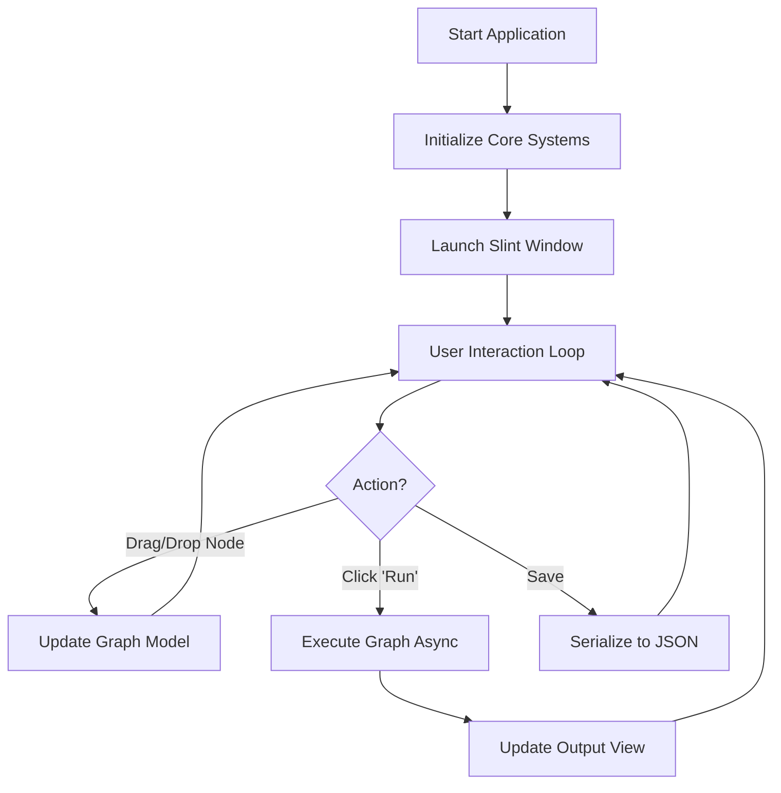
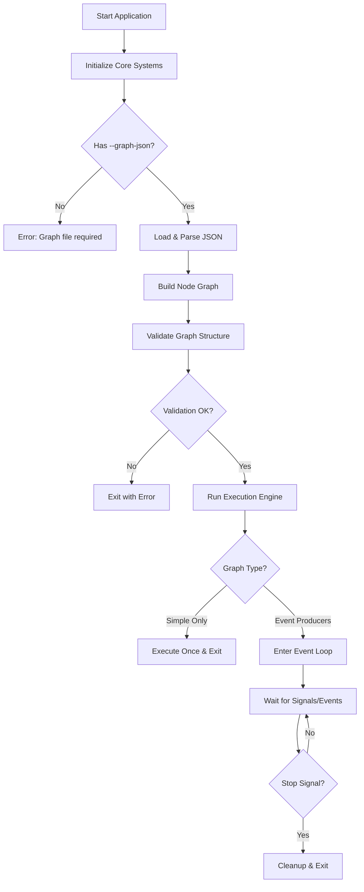

# Program Execution Flow

> **Target audience:** Users and Developers interested in how the application initializes runs.

This document outlines the internal execution flow of the zihuan-next system in its two primary modes: GUI and Headless.

---

## Table of Contents

- [Program Execution Flow](#program-execution-flow)
  - [Table of Contents](#table-of-contents)
  - [Overview](#overview)
  - [GUI Mode Execution](#gui-mode-execution)
    - [Startup Flow](#startup-flow)
    - [Characteristics](#characteristics)
  - [Headless Mode Execution](#headless-mode-execution)
    - [Startup Flow](#startup-flow-1)
    - [Characteristics](#characteristics-1)
  - [Execution Logic Comparison](#execution-logic-comparison)
  - [See Also](#see-also)

---

## Overview

The application decides which mode to launch based on command-line arguments.

- **No arguments**: Defaults to **GUI Mode**.
- **`--no-gui` argument**: Forces **Headless Mode**.

Regardless of mode, the system always performs these initial steps:
1.  **Initialize Logging**: Sets up console and file logging (`./logs/`).
2.  **Load Configuration**: Reads `config.yaml` and environment variables.
3.  **Register Nodes**: Dynamically registers all known node types (Bot, LLM, Utility) into the internal registry.

---

## GUI Mode Execution

In GUI mode, the application launches a Slint-based window system. The execution engine runs in response to user actions or in a separate thread to keep the UI responsive.

### Startup Flow

### Characteristics
- **Main Thread**: Occupied by the UI event loop.
- **Graph Execution**: Can be triggered manually.
- **Visual Feedback**: Real-time port status and execution logs are displayed in the UI.

---

## Headless Mode Execution

Headless mode is designed for automation and production. It involves no windowing system and relies entirely on the provided JSON graph definition.

### Startup Flow

### Characteristics
- **Main Thread**: Blocks on the `execute()` call or event loop.
- **Lifecycle**: Runs until all `EventProducer` nodes signal completion or the process is terminated (SIGINT/Ctrl+C).
- **Output**: Logs are directed to `stdout` and log files.

---

## Execution Logic Comparison

| Feature | GUI Mode | Headless Mode |
| :--- | :--- | :--- |
| **Purpose** | Design, Debug, Quick Test | Production, Long-running Bot |
| **Input Source** | Interactive Canvas | JSON File (`--graph-json`) |
| **User Interface** | Slint Window | Terminal / Logs |
| **Termination** | User closes window | Process signal / Node completion |
| **Concurrency** | Execution on background thread | Main thread blocks/loops |

---

## See Also

- **[User Guide](./user-guide.md)** — Installation and usage instructions.
- **[Node Lifecycle](./node/node-lifecycle.md)** — Detailed breakdown of how nodes utilize the execution engine.
